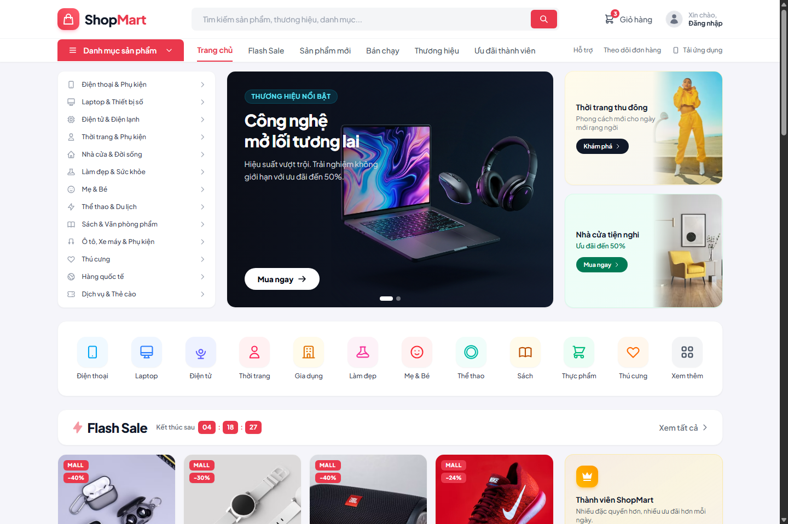
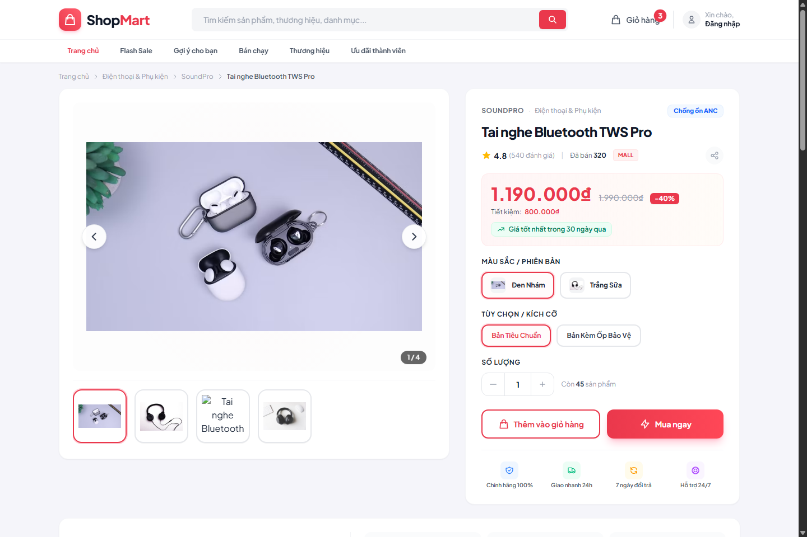
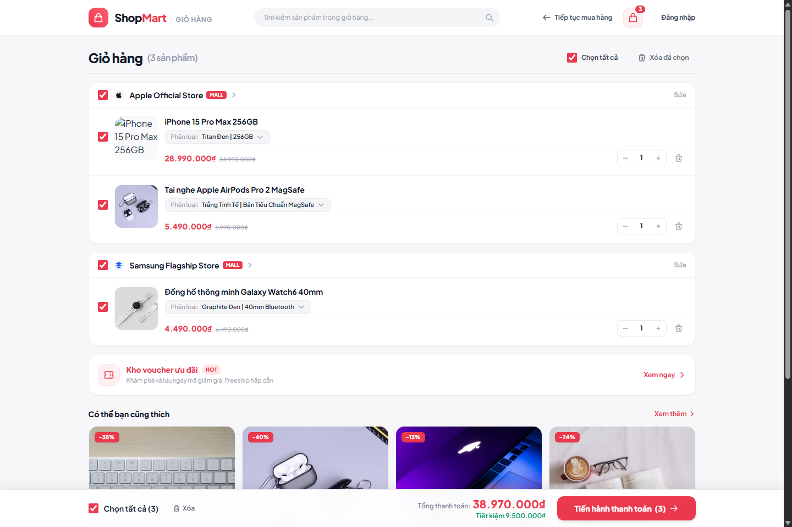
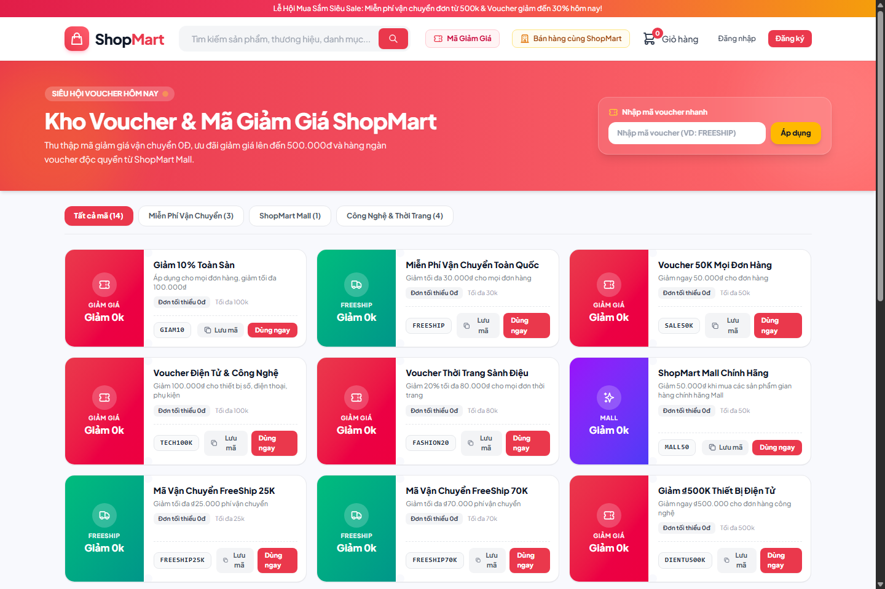
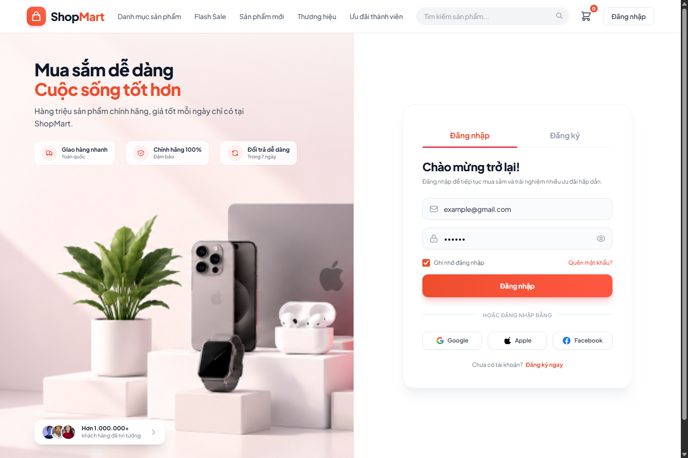
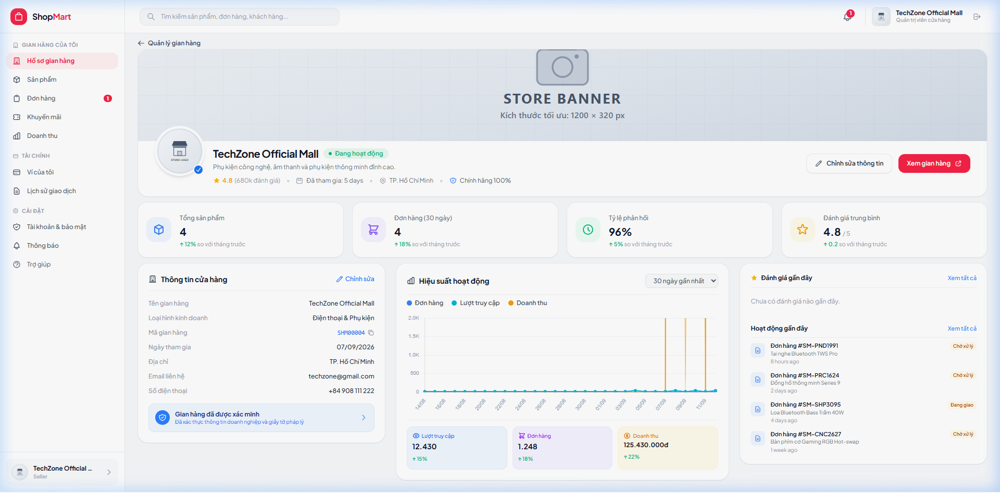
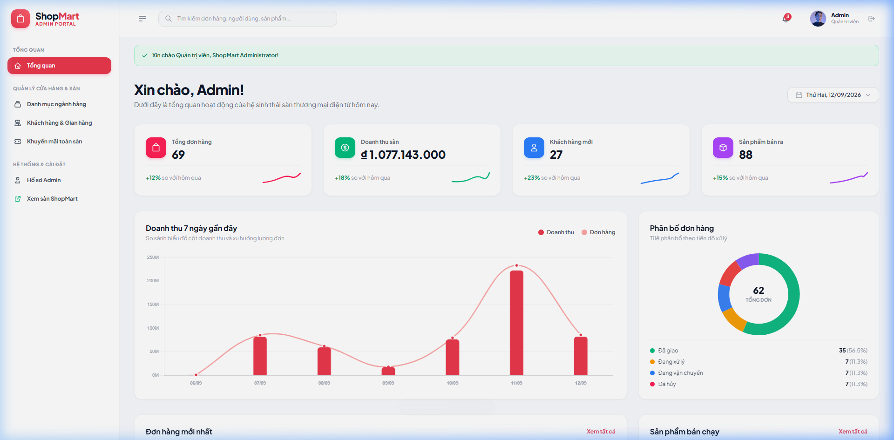

<div align="center">

# ShopMart — Multi-Vendor E-Commerce Platform

A multi-vendor e-commerce marketplace web application built with **Laravel 13**, **PHP 8.4**, **Blade**, and **Tailwind CSS v4**.<br>
ShopMart provides an end-to-end shopping experience connecting buyers, independent store vendors, and platform administrators.

<br />

[](https://github.com/Phenikaa-team/E-commerce-platform-website)
[](https://www.php.net/)
[](https://laravel.com/)
[](https://tailwindcss.com/)
[](https://vite.dev/)
[](https://www.sqlite.org/)
[](tests/Feature/MarketplaceEcosystemTest.php)
[](LICENSE)

</div>

---

## Overview

ShopMart is designed as a centralized e-commerce hub where customers can discover products from diverse official brand stores, customize product variants, manage multi-vendor shopping carts, apply discount vouchers, and place orders. 

The platform implements dedicated portals and role-based workflows for three user types:
1. **Buyers:** Storefront browsing, real-time search, cart management, checkout with discount vouchers, order tracking, reviews, and wishlist.
2. **Sellers (Vendors):** Onboarding, catalog and variant management, order fulfillment pipeline, shop-level voucher campaigns, and 30-day sales analytics.
3. **Platform Administrators:** Platform-wide oversight, category hierarchy management, customer & store governance, global promotional coupon distribution, and revenue KPI monitoring.

---

## Visual Showcase

### Storefront Homepage
Dynamic storefront featuring category navigation, promotional hero banners, flash sales with live countdowns, official mall showcases, and trending products.



### Product Detail & Variant Selection
Interactive product view with high-resolution image gallery, interactive variant selection (color, specifications), real-time stock indicator, warranty highlights, and rating breakdown.



### Multi-Store Shopping Cart
Intelligent cart grouping items by vendor/store, individual item selection, quantity adjustments, dynamic price recalculation, and sticky checkout action bar.



### Promotion & Voucher Hub
Centralized coupon center showcasing categorized discount vouchers (platform-wide, free shipping, category-specific) with minimum spend rules and direct voucher code claiming.



### Authentication & Onboarding
Clean, responsive authentication interface featuring unified login and registration, password toggling, client-side validation, and social login buttons.



### Seller Management Portal
Vendor management suite featuring store branding, revenue charts, order processing queue, product inventory management, and customer rating metrics.



### System Administration Dashboard
Comprehensive administrative control center displaying platform gross merchandise volume (GMV), 7-day revenue trends, order status distribution donut chart, and operational shortcuts.



---

## Key Features

### Storefront & Customer Experience
- **Live Search & Auto-Suggestions:** Real-time search API (`/api/search/suggestions`) suggesting products and categories as users type.
- **Product Catalog & Filtering:** Browse by categories, flash sale collections, top brands, and featured items.
- **Rich Product Details:** Multi-angle image carousels, dynamic variant picking (color, configuration), pricing discounts, stock levels, and authentic verified store badges.
- **Voucher Hub:** Explore and collect percentage-based or fixed-amount discounts and shipping vouchers.

### Cart & Checkout System
- **Vendor-Grouped Cart:** Cart items are automatically clustered by vendor store with individual check-all controls per store.
- **Dynamic Coupon Engine:** Instant AJAX coupon validation (`/checkout/apply-coupon`) calculating percentage or fixed discounts against order minimums and discount caps.
- **Address Management:** Fast delivery address modal with recipient name, phone validation, and default address selection.
- **Flexible Payments:** Support for Cash on Delivery (COD) and VNPay payment gateway integration with callback verification (`/checkout/vnpay-return`).

### Buyer Account Hub
- **Profile Management:** Personal info update, profile avatar, and address book management.
- **Order Tracking:** View order progression across lifecycle states (`pending` → `processing` → `shipped` → `delivered` / `cancelled`).
- **Social Proof:** Submit star ratings and customer reviews on delivered items.
- **Wishlist:** Quick toggle to save favorite products for later purchase.

### Seller (Vendor) Portal
- **Vendor Onboarding:** Self-service registration route (`/seller/register`) converting existing accounts to verified vendors.
- **Product Inventory Management:** Full CRUD operations for products, images, stock levels, prices, and variant attributes.
- **Order Processing:** Track incoming orders, inspect buyer details, and update fulfillment states.
- **Sales Analytics:** Visual revenue breakdown, 30-day performance charts, and average store review score tracking.
- **Shop Vouchers:** Create and manage store-specific promotional discount codes.

### Administration Control Panel
- **Executive Metrics:** Live statistics tracking total platform revenue, total orders placed, new customer acquisitions, and sold units.
- **Category Management:** Create, edit, and organize product categories.
- **User & Store Governance:** Monitor registered users and store listings; toggle account status (`active` / `suspended`), update user roles, or reset credentials.
- **Site-Wide Promotional Coupons:** Deploy platform-wide vouchers with global usage constraints.

### 🔌 RESTful API (v1)
A clean JSON API layer under `/api/v1`:
- `GET /api/v1/health` — Health check endpoint.
- `GET /api/v1/categories` — Product category listing.
- `GET /api/v1/stores` — Active vendor stores.
- `GET /api/v1/products` — Paginated catalog with keyword search and category filters.
- `GET /api/v1/products/{product}` — Detailed product schema and pricing.
- `POST /api/v1/cart/items` — Add items to session or user cart.
- `GET /api/v1/cart/{cart}` — Retrieve cart items and totals.
- `POST /api/v1/orders` — Programmatic order creation.
- `GET /api/v1/orders/{order}` — Inspect order details.

---

## Tech Stack

| Domain | Technology | Description |
| :--- | :--- | :--- |
| **Backend Framework** | [Laravel 13](https://laravel.com/) | Robust MVC architecture, Eloquent ORM, Route model binding |
| **Runtime & Language** | [PHP 8.4](https://www.php.net/) | Modern typed PHP with constructor promotion and strict typing |
| **Frontend Templates** | [Blade](https://laravel.com/docs/blade) | Server-rendered reusable component layouts (`x-product-card`, `x-logo`) |
| **Styling & Design** | [Tailwind CSS v4](https://tailwindcss.com/) | Modern utility-first CSS via `@tailwindcss/vite` |
| **Asset Bundler** | [Vite 8](https://vite.dev/) | Lightning-fast HMR and optimized production asset pipeline |
| **Database** | [SQLite](https://www.sqlite.org/) / [MySQL](https://www.mysql.com/) | SQLite by default for zero-config local development; MySQL compatible |
| **Testing Suite** | [PHPUnit 12](https://phpunit.de/) | Automated feature and unit tests with `RefreshDatabase` |
| **Authentication** | Laravel Session Auth | Secure cookie/database session authentication with custom role middlewares |

---

## Architecture & Data Flow

```text
                               ┌─────────────────────────┐
                               │   Web & Mobile Client   │
                               └────────────┬────────────┘
                                            │ HTTP / HTTPS
                                            ▼
                               ┌─────────────────────────┐
                               │     Laravel Routing     │
                               │  (web.php  |  api.php)  │
                               └────────────┬────────────┘
                                            │
                    ┌───────────────────────┼───────────────────────┐
                    ▼                       ▼                       ▼
             [Public Routes]        [IsSeller Gate]          [IsAdmin Gate]
             • Storefront            • Seller Dashboard       • Admin Dashboard
             • Cart & Checkout       • Product CRUD           • Category CRUD
             • Buyer Profile         • Order Fulfillment      • Store Governance
                    │                       │                       │
                    └───────────────────────┼───────────────────────┘
                                            ▼
                               ┌─────────────────────────┐
                               │  Controllers & Services │
                               └────────────┬────────────┘
                                            │
                                            ▼
                               ┌─────────────────────────┐
                               │      Eloquent Models    │
                               │  User, Store, Product,  │
                               │  Cart, Order, Coupon... │
                               └────────────┬────────────┘
                                            │
                                            ▼
                               ┌─────────────────────────┐
                               │     Database (SQLite)   │
                               └─────────────────────────┘
```

### Role-Based Access Control

The application enforces middleware-level role boundaries:
- `auth`: Guarantees the requester is an authenticated user.
- `is_seller`: Verifies that the user has an active seller role and an associated `Store` entity. Non-sellers trying to access the vendor portal are redirected to `/seller/register`.
- `is_admin`: Restricts administrative routes to users with `role === 'admin'`. Unauthorized requests return `403 Forbidden`.

---

## Project Structure

```text
.
├── app/
│   ├── Http/
│   │   ├── Controllers/
│   │   │   ├── Admin/              # Admin dashboard, users, categories, coupons
│   │   │   ├── Api/                # RESTful API endpoints (v1)
│   │   │   ├── Seller/             # Seller dashboard, products CRUD, order manager
│   │   │   ├── AuthController.php  # Login, register, logout, social auth
│   │   │   ├── CartWebController.php
│   │   │   ├── CheckoutController.php
│   │   │   ├── ProductController.php
│   │   │   └── ProfileController.php
│   │   └── Middleware/
│   │       ├── IsAdmin.php         # Admin role protection
│   │       └── IsSeller.php        # Seller role protection
│   └── Models/                     # User, Store, Product, Cart, Order, Coupon, etc.
├── database/
│   ├── factories/                  # Model test factories
│   ├── migrations/                 # Schema migrations for multi-vendor tables
│   └── seeders/                    # Seeders with comprehensive mock data & accounts
├── docs/
│   └── screenshots/                # Application preview screenshots
├── resources/
│   ├── css/                        # Tailwind CSS styles and custom UI tokens
│   ├── js/                         # Frontend client scripts and AJAX handlers
│   └── views/                      # Blade templates
│       ├── admin/                  # Admin portal views
│       ├── components/             # Reusable Blade UI components
│       ├── layouts/                # Base layouts (app, admin, seller)
│       ├── seller/                 # Seller portal views
│       ├── auth.blade.php          # Authentication view
│       ├── cart.blade.php          # Shopping cart view
│       ├── checkout.blade.php      # Checkout view
│       ├── product-detail.blade.php# Product page view
│       ├── shopmart.blade.php      # Main storefront homepage view
│       └── vouchers.blade.php      # Voucher hub view
├── routes/
│   ├── api.php                     # REST API route definitions
│   ├── console.php                 # Artisan console commands
│   └── web.php                     # Storefront, Seller, and Admin web routes
├── tests/
│   └── Feature/
│       └── MarketplaceEcosystemTest.php # Comprehensive feature test suite
├── composer.json                   # PHP package dependencies and scripts
├── package.json                    # Frontend assets and build scripts
└── vite.config.js                  # Vite configuration with Tailwind plugin
```

---

## Getting Started

### Prerequisites

Ensure the following runtimes are installed on your workstation:
- **PHP:** `^8.3` or `^8.4` (with `pdo_sqlite`, `mbstring`, `openssl`, `curl` extensions enabled)
- **Composer:** `^2.x`
- **Node.js:** `^18.x`, `^20.x`, or `^22.x`
- **NPM:** `^9.x` or `^10.x`

### Installation & Setup

1. **Clone the Repository:**
   ```bash
   git clone https://github.com/Phenikaa-team/E-commerce-platform-website.git
   cd E-commerce-platform-website
   ```

2. **Install PHP Dependencies:**
   ```bash
   composer install
   ```

3. **Install JavaScript Dependencies:**
   ```bash
   npm install
   ```

4. **Environment Configuration:**
   ```bash
   # Linux / macOS
   cp .env.example .env

   # Windows (PowerShell)
   Copy-Item .env.example .env
   ```

5. **Generate Application Key:**
   ```bash
   php artisan key:generate
   ```

6. **Initialize Database & Seed Mock Data:**
   By default, the application uses SQLite. Create the database file if it does not exist, then run migrations and seeders:
   ```bash
   # Touch database file if using SQLite
   touch database/database.sqlite

   # Run migrations with demo seeders
   php artisan migrate:fresh --seed
   ```

7. **Compile Frontend Assets:**
   ```bash
   npm run build
   ```

8. **Start the Development Server:**
   You can start both the Laravel server and Vite asset watcher concurrently:
   ```bash
   composer run dev
   ```
   Or run the services individually in separate terminal windows:
   ```bash
   # Terminal 1: Laravel Backend
   php artisan serve

   # Terminal 2: Vite Frontend Watcher
   npm run dev
   ```

The application will be accessible at: `http://localhost:8000` (or `http://127.0.0.1:8000`).

---

## Seeded Demo Accounts

The database seeders provide pre-configured accounts for testing each role immediately after seeding:

| Role | Portal URL | Email Address | Password | Permissions & Notes |
| :--- | :--- | :--- | :--- | :--- |
| **Administrator** | `/admin/dashboard` | `admin@gmail.com` | `admin` | Full system governance, store control, category management |
| **Official Seller** | `/seller/dashboard` | `techzone@gmail.com` | `techzone` | Manages **TechZone Official Mall** store & products |
| **Brand Seller** | `/seller/dashboard` | `samsung@gmail.com` | `samsung` | Manages **Samsung Flagship Store** store & products |
| **Brand Seller** | `/seller/dashboard` | `apple@gmail.com` | `apple` | Manages **Apple Official Store** store & products |
| **Customer (Buyer)** | `/profile` | `example@gmail.com` | `123456` | Pre-seeded with saved delivery addresses, order history, and cart |

---

## Automated Testing

The project includes an automated feature test suite covering live search suggestions, coupon calculation logic, checkout processing, order placement, and role-based middleware guards (`is_seller`, `is_admin`):

To run the complete test suite:

```bash
php artisan test
```

Or execute via PHPUnit directly:

```bash
vendor/bin/phpunit
```

All 18 feature test scenarios pass out of the box with zero failures.

---

## Useful Artisan Commands

```bash
# Clear application and configuration caches
php artisan optimize:clear

# List all registered application routes
php artisan route:list

# Re-seed database with fresh demonstration data
php artisan migrate:fresh --seed
```

---

## License

This project is open-source software licensed under the [MIT License](LICENSE).
